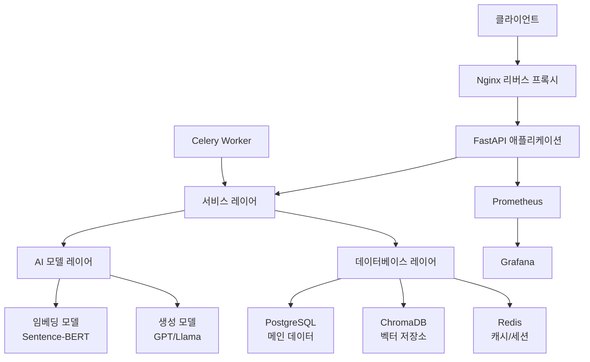

#  Fragrance AI: Advanced Perfume Recommendation & Recipe Generation System

<p align="center">
  
  
  
  
  
  
  
</p>

<p align="center">
  <strong>한국어 특화 AI 기반 향수 검색 및 레시피 생성 플랫폼</strong>
</p>

<p align="center">
  <a href="#-features">Features</a> •
  <a href="#-architecture">Architecture</a> •
  <a href="#-installation">Installation</a> •
  <a href="#-usage">Usage</a> •
  <a href="#-api">API</a> •
  <a href="#-deployment">Deployment</a> •
  <a href="#-contributing">Contributing</a>
</p>

##  프로젝트 개요

Fragrance AI는 최신 AI 기술을 활용하여 향수 레시피를 자동 생성하고, 의미 기반 검색을 제공하는 혁신적인 시스템입니다. 한국어에 특화된 AI 모델과 향수 전문 도메인 지식을 결합하여 창의적이고 실현 가능한 향수 레시피를 생성합니다.

###  주요 기능

- ** AI 향수 레시피 생성**: 창의적이고 실현 가능한 향수 조합 자동 생성
- ** 의미 기반 검색**: 자연어로 원하는 향수 특성 검색
- ** 품질 평가 시스템**: AI 기반 레시피 품질 자동 평가
- ** RESTful API**: 확장 가능한 웹 API 제공
- ** 실시간 모니터링**: 시스템 성능 및 사용량 모니터링
- ** 하이브리드 검색**: 벡터 검색과 전통적 필터링의 결합

##  시스템 아키텍처



##  빠른 시작

### 사전 요구사항

- Python 3.10+
- Docker & Docker Compose
- NVIDIA GPU (선택사항, 성능 향상을 위해 권장)

### 1. 저장소 클론

```bash
git clone https://github.com/junseong2im/innovative_perfume_ai.git
cd innovative_perfume_ai
```

### 2. 환경 변수 설정

```bash
cp .env.example .env
# .env 파일을 수정하여 환경에 맞는 값들을 설정하세요
```

### 3. Docker를 사용한 실행

```bash
# 전체 스택 실행
docker-compose up -d

# 로그 확인
docker-compose logs -f fragrance_ai
```

### 4. 개발 환경 설정

```bash
# 가상환경 생성 및 활성화
python -m venv venv
source venv/bin/activate  # Windows: venv\Scripts\activate

# 의존성 설치
pip install -r requirements.txt

# 데이터베이스 마이그레이션
alembic upgrade head

# 개발 서버 실행
uvicorn fragrance_ai.api.main:app --reload --host 0.0.0.0 --port 8000
```

##  API 사용법

### 의미 검색 API

```python
import requests

# 향수 검색
response = requests.post("http://localhost:8000/api/v1/search/semantic", json={
    "query": "상큼하고 로맨틱한 봄 향수",
    "top_k": 10,
    "search_type": "similarity"
})

results = response.json()
```

### 레시피 생성 API

```python
# 레시피 생성
response = requests.post("http://localhost:8000/api/v1/generate/recipe", json={
    "fragrance_family": "floral",
    "mood": "romantic",
    "intensity": "moderate",
    "gender": "feminine",
    "season": "spring"
})

recipe = response.json()
```

### 배치 생성 API

```python
# 여러 레시피 동시 생성
response = requests.post("http://localhost:8000/api/v1/generate/batch", json={
    "requests": [
        {
            "fragrance_family": "citrus",
            "mood": "fresh",
            "intensity": "light"
        },
        {
            "fragrance_family": "woody",
            "mood": "sophisticated",
            "intensity": "strong"
        }
    ]
})
```

##  모델 훈련

### 임베딩 모델 훈련

```bash
python scripts/train_model.py \
    --model-type embedding \
    --data-path ./data/training/embedding_data.json \
    --output-dir ./checkpoints/embedding \
    --epochs 5 \
    --batch-size 32 \
    --wandb-project fragrance-ai
```

### 생성 모델 훈련 (LoRA)

```bash
python scripts/train_model.py \
    --model-type generation \
    --data-path ./data/training/generation_data.json \
    --output-dir ./checkpoints/generation \
    --use-lora \
    --use-4bit \
    --epochs 3 \
    --batch-size 4
```

##  모델 평가

```bash
# 임베딩 모델 평가
python scripts/evaluate_model.py \
    --model-type embedding \
    --model-path ./checkpoints/embedding \
    --eval-data ./data/evaluation/embedding_eval.json

# 생성 모델 평가
python scripts/evaluate_model.py \
    --model-type generation \
    --model-path ./checkpoints/generation \
    --eval-data ./data/evaluation/generation_eval.json \
    --health-check
```

##  배포

### 개발 환경 배포

```bash
./scripts/deploy.sh development --health-check
```

### 프로덕션 배포

```bash
./scripts/deploy.sh production --backup --health-check --cleanup
```

### 쿠버네티스 배포

```bash
# Helm 차트 사용 (별도 구성 필요)
helm install fragrance-ai ./helm/fragrance-ai \
    --namespace fragrance-ai \
    --create-namespace \
    --values values.production.yaml
```

##  프로젝트 구조

```
fragrance_ai/
├── fragrance_ai/                 # 메인 애플리케이션
│   ├── api/                      # FastAPI 애플리케이션
│   │   ├── main.py              # 메인 애플리케이션 파일
│   │   ├── routes/              # API 라우트
│   │   ├── schemas.py           # Pydantic 스키마
│   │   └── middleware.py        # 미들웨어
│   ├── core/                    # 핵심 모듈
│   │   ├── config.py           # 설정 관리
│   │   └── vector_store.py     # 벡터 데이터베이스
│   ├── models/                  # AI 모델
│   │   ├── embedding.py        # 임베딩 모델
│   │   └── generator.py        # 생성 모델
│   ├── services/                # 서비스 레이어
│   │   ├── search_service.py   # 검색 서비스
│   │   └── generation_service.py # 생성 서비스
│   ├── training/                # 모델 훈련
│   │   └── peft_trainer.py     # PEFT 훈련
│   ├── evaluation/              # 평가 시스템
│   │   └── metrics.py          # 평가 메트릭
│   └── database/                # 데이터베이스
│       ├── models.py           # SQLAlchemy 모델
│       └── base.py             # 데이터베이스 기본 설정
├── scripts/                     # 유틸리티 스크립트
│   ├── train_model.py          # 모델 훈련 스크립트
│   ├── evaluate_model.py       # 모델 평가 스크립트
│   └── deploy.sh               # 배포 스크립트
├── configs/                     # 환경 설정 파일
├── data/                        # 데이터 디렉토리
├── tests/                       # 테스트 코드
├── docker-compose.yml           # Docker Compose 설정
├── Dockerfile                   # Docker 빌드 파일
└── requirements.txt             # Python 의존성
```

##  개발 환경 설정

### 코드 품질 도구

```bash
# 코드 포맷팅
black fragrance_ai/
isort fragrance_ai/

# 린팅
flake8 fragrance_ai/
pylint fragrance_ai/

# 타입 체킹
mypy fragrance_ai/
```

### 테스트 실행

```bash
# 전체 테스트
pytest

# 특정 테스트
pytest tests/test_api.py

# 커버리지 포함
pytest --cov=fragrance_ai
```

### 사전 커밋 훅 설정

```bash
# pre-commit 설치 및 설정
pip install pre-commit
pre-commit install
```

##  모니터링 및 로깅

### 접속 정보

- **API 문서**: http://localhost:8000/docs
- **Grafana 대시보드**: http://localhost:3000
- **Prometheus 메트릭**: http://localhost:9090
- **Flower (Celery 모니터링)**: http://localhost:5555

### 주요 메트릭

- API 응답 시간 및 처리량
- 모델 추론 성능
- 데이터베이스 성능
- 캐시 히트율
- 에러율 및 가용성

##  기여하기

1. Fork the repository
2. Create your feature branch (`git checkout -b feature/amazing-feature`)
3. Commit your changes (`git commit -m 'Add some amazing feature'`)
4. Push to the branch (`git push origin feature/amazing-feature`)
5. Open a Pull Request

### 코딩 컨벤션

- Python: PEP 8 준수
- 커밋 메시지: Conventional Commits 형식
- 테스트: 새로운 기능에 대한 테스트 코드 필수
- 문서화: 공개 API에 대한 docstring 필수

##  성능 벤치마크

### 시스템 요구사항

| 구성 요소 | 최소 사양 | 권장 사양 |
|---------|---------|---------|
| CPU | 4 cores | 8+ cores |
| RAM | 16GB | 32GB+ |
| GPU | 8GB VRAM | 24GB+ VRAM |
| 저장소 | 100GB SSD | 500GB+ NVMe |

### 성능 지표

- **검색 응답시간**: < 200ms (평균)
- **레시피 생성시간**: < 3초 (기본), < 10초 (상세)
- **동시 사용자**: 1000+ concurrent users
- **처리량**: 10,000+ requests/hour

##  보안

### 보안 기능

- JWT 기반 인증
- API Rate Limiting
- CORS 설정
- 입력 검증 및 새니타이제이션
- HTTPS 강제 (프로덕션)
- 민감 정보 암호화

### 보안 모범 사례

- 정기적인 의존성 업데이트
- 시크릿 키 로테이션
- 로그 민감정보 마스킹
- 보안 헤더 설정

##  라이센스

이 프로젝트는 **독점 라이센스(Proprietary License)** 하에 배포됩니다. 자세한 내용은 [LICENSE](LICENSE) 파일을 참조하세요.

###  중요한 라이센스 제한사항

- **읽기 전용**: 소스코드는 개인 학습 목적으로만 열람 가능합니다
- **복사 금지**: 코드의 복사, 수정, 배포가 엄격히 금지됩니다
- **상업적 이용 금지**: 영리 목적 사용이 불가능합니다
- **연구 목적 금지**: 학술 연구나 논문 작성에 사용할 수 없습니다
- **AI 학습 금지**: 다른 AI 모델 훈련에 사용할 수 없습니다

### 라이센스 문의

라이센스 범위를 벗어난 사용에 대한 문의사항은 다음으로 연락하세요:
- 이메일: junseong2im@gmail.com

### 사용된 오픈소스 라이센스

본 프로젝트는 다음 오픈소스 라이브러리들을 사용합니다 (각각의 라이센스에 따라 사용됨):
- Transformers (Apache 2.0)
- FastAPI (MIT)
- ChromaDB (Apache 2.0)
- Sentence-Transformers (Apache 2.0)

##  지원 및 문의

- **이슈 리포팅**: [GitHub Issues](https://github.com/junseong2im/innovative_perfume_ai/issues)
- **기능 요청**: [GitHub Discussions](https://github.com/junseong2im/innovative_perfume_ai/discussions)
- **이메일**: junseong2im@gmail.com

##  감사의 말

이 프로젝트는 다음 오픈소스 프로젝트들의 도움을 받았습니다:

- [Hugging Face Transformers](https://github.com/huggingface/transformers)
- [FastAPI](https://github.com/tiangolo/fastapi)
- [ChromaDB](https://github.com/chroma-core/chroma)
- [Sentence-
